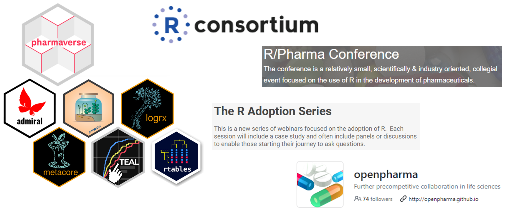
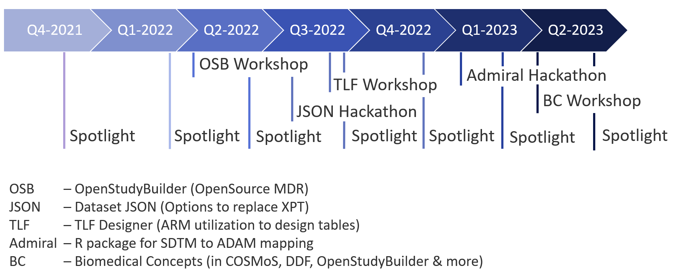

# Open Source News (2023-06-26)

## Summary

Open-Source is becoming more popular in the area of pharma. There is a huge progress around the programming language R. But also outside of R we have many developments within the open-source space. Next to CDISC which founded COSA (the CDISC Open Source Alliance) in 2021, PHUSE recently created a role of an "Open Source Technologies Director" apart from having various open-source working groups. We see conference streams focusing on open-source solutions and the number of tools and projects is increasing nicely.

## R Universe

The [pharmaverse](https://pharmaverse.org/) is a collaboration to "to agree on a curated and opinionated subset of open-source software packages and codebases, [...] in order to deliver the clinical data pipeline.". The most well-known package is [admiral](https://pharmaverse.github.io/admiral/cran-release/) (for data mapping from the SDTM to the ADAM standard format) which is so successful that additional packages for specific therapeutical areas has been added ([admiralonco](https://pharmaverse.github.io/admiralonco), [admiralophtha](https://pharmaverse.github.io/admiralophtha/main/), admiralvaccine). By now there are also two huge frameworks available: [teal](https://insightsengineering.github.io/teal/latest-tag/) to support Analysis with Shiny and [tern](https://insightsengineering.github.io/tern/latest-tag/) which contains analysis functions for tables and graphs. The pharmaverse contains also anything else what would be needed for clinical trial evaluations and submissions.

The [RConsortium](https://www.r-consortium.org/) is supporting various activities like the [RValidation Hub](https://www.pharmar.org/) providing resources about validation topics. The ["The R Adoption Series"](https://r-consortium.org/webinars/webinars.html) is very valuable list of webinars which show how to adopt our industry to R. The [R/Pharma](https://rinpharma.com/) conference is growing continuously - the presentation  recordings are very valuable. These are listed and searchable in the [conference videos area](https://www.glacon.eu/portal/confVideos) for the open source portal for clinical study evaluations.

Additionally, many other R packages are made available as open-source. Some are located in the "Open Source in Pharma" [repository group](https://github.com/openpharma) and some are made available on other repositories.

## COSA (CDISC Open Source Alliance)

The CDISC Open Source Alliance ([COSA](https://cosa.cdisc.org/)) is activly working on supporting open-source for CDISC related projects. If you need support or have questions, you can simply contact COSA via mail [cosa@cdisc.org]. 

Since it's foundation in 2021, COSA did quite some work. There are quarterly spotlights highlighting open source solutions and workshops, webinars which had been performed. The first workshop was at the EU Interchange on the 29. April 2022 which was virtually. This workshop introduced the OpenStudyBuilder solution. The Dataset-JSON Hackathon starting on July was calling for various solutions about the dataset-JSON upcoming standard. Hopefully this will replace our XPT files more sooner than later (see ongoing projects). The TLF Designer Workshop got a very high attraction, as we want to see the opportunities of ARM (analysis results metadata) in action. The admiral hackathon provided an excellent opportunity to learn the tool and general process, also for SAS programmers to try this our in R. The latest workshop was at the EU Interchange and a live workshop about Biomedical Concepts. 

Apart from these events, COSA maintains a [directory](https://cosa.cdisc.org/) of CDISC related open source solutions - there you can also find all solutions created during the Dataset-JSON hackathon. Next to this directory and a description on how you can apply to be listed as well, it contains additional information like links to other open-source pages, some open-source license information and a FAQ area.

## OpenStudyBuilder

The OpenStudyBuilder is a huge open-source solution which is currently developed and managed by Novo Nordisk. This solution should support the end-to-end vision created by the CDISC 360° project. The complete study pipeline from protocol creation through data capture, evaluation and submission should be driven by metadata which connects all single steps for full transparency. 

The OpenStudyBuilder is continuesly evolving and supports by now the protocol generation very well. The CRF design and EDC connection is currently in progress. The vision is that the mappings from CDASH to SDTM (with the OAD initiative) and from SDTM to ADAM (with the admiral initiative) will be metadata driven, so that also these steps could be (at least partially) automated through metadata.

## PHUSE

Also for PHUSE the open-source space becomes a focus point. Next to the long existing working group, a new directors role in the PHUSE board has been created: Open Source Technologies Director. From the working groups, the "End-to-End Open-source Collaboration Guidance" had been quite active and created a [guide](https://phuse-org.github.io/E2E-OS-Guidance/).

## Other Projects

### OAK

The new OAK project has recently just started. OAK is an open-source community project to evolve software that uses agnostic transformation logic to enable mapping of CDASH to SDTM whose functionality will also generate raw synthetic data. 

The scope is pretty:

- Pick domains like DM, CM, MH, VS, EC, EX, and DS for the PoC.
- Add algorithms and associated metadata to CDISC Library for CDASH standards. (similar to what the Roche team did in Roche’s MDR)
- Modify Roche version of the {oak} package to work with CDISC Library and ODM clinical data format to enable metadata-driven automation. This might be an extension of the - {oak} package, something like {oak.cdash}, or could be a new package by itself.
- Use {oak.cdash} package and automate SDTM. If successful, expand to all CDASH standards and develop the {oak.cdash} package to support all algorithms.

To participate of find additional information, please check the CDISC [page](https://www.cdisc.org/oak).

### Dataset-JSON

Finally we seek for a solution to replace the XPT transfer format to submit datasets to authorities. If you would like to participate, you can send a mail to:  workinggroups@phuse.global. The pilot project is being run through the PHUSE Emerging Trends and Technologies Working group. Additional information will come soon.

### CORE

Also the CDISC Open Rules Engine (CORE) is evolving. You can look at the [website](https://www.cdisc.org/core) for further information.

### TLF Designer 

For the TLF Designer coming events are planned. Watch out at the COSA homepage for new entered events. You can also checkout the TLF Designer repository [here](https://github.com/bhavinbusa/tfldesigner/).

## Disclaimer

The opinion in this article are purely those from the author and does not necessarily confirm those from mentioned organizations and companies, nor from the portal operator.

## About the Author

Katja Glaß has IT background and is for more than 15 years in the pharmaceutical industry. She is now working as part-time consultant focusing on open source for Pharma, hosting a portal about open-source solutions for clinical study evaluations. She has key experiences with SAS, Web Technologies, ADAM, Define.xml and the TLF generation. She is a very active PHUSE member where she led the EU Connect conference in 2018. In 2021 she became board member of COSA to support this initiative as well.
